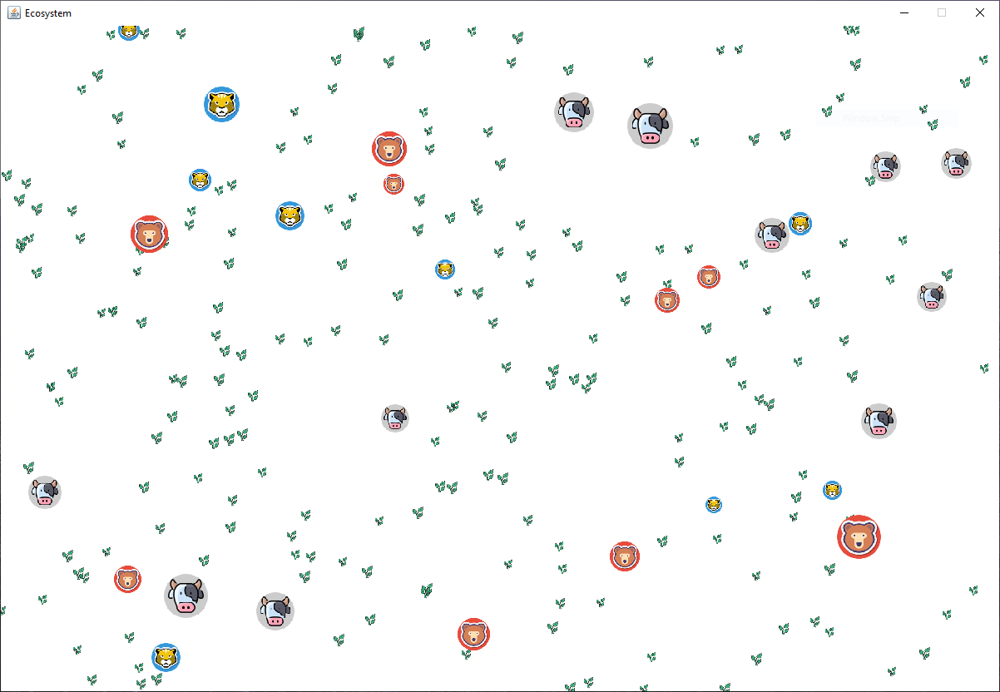
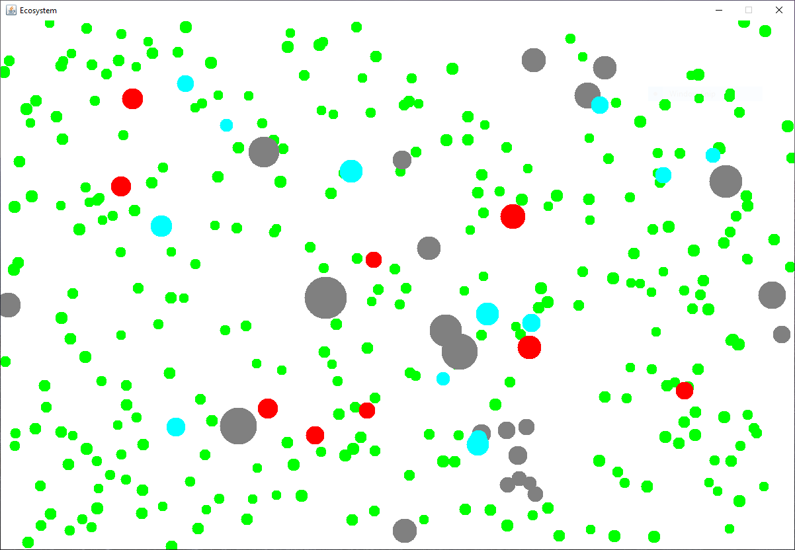
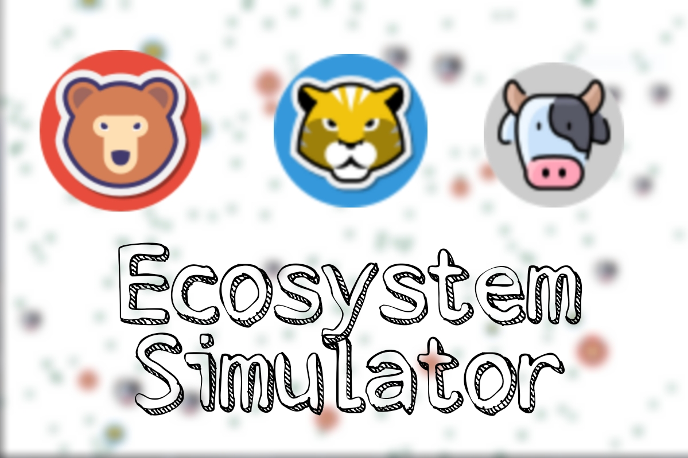

# Ecosystem Simulator

It simulates a basic ecosystem where Herbivores eat plants, Carnivores eat Herbivores and Cannibals and Cannibals eat themselves including both Herbivores and Carnivores.

|                            Sprites                             |   Role    |
| :------------------------------------------------------------: | :-------: |
|   | Cannibal  |
|   | Herbivore |
|  |   Tiger   |

[Download Ecosystem Simulator](https://github.com/ShehzadAslamOza/ecosystem-simulation/raw/main/out/artifacts/ecosystem_jar/ecosystem.jar)

---

### Conditions Followed by the Simulation

- Plants will be randomly generated and will be eaten by the Herbivores
- Carnivores will eat Herbivores and Cannibals
- There will be another class Cannibal which will inherit from Carnivore and will eat both
  Herbivore and Carnivore [ including itself ]
- After some time, if any of the Carnivores or Herbivores are alive and have reached a
  certain size, they will die and leave behind offspring. A carnivore will leave 4, herbivore 8
  and cannibal 2.
- Plants will automatically be generated after some time to maintain the supply of food
- Plants will grow in size after a bit of time, but they will grow much slowly than the animals
- If any of the animals has not eaten for a long time, it will die without leaving behind an
  offspring
- The difference between the speeds of herbivores and carnivores will be 1
- An animal will eat another animal or plant only if the size is equal or smaller.
- An animal will chase its prey and when it is eaten, it will go towards the next closest prey
- It will only eat the prey it is chasing [if there is a prey closer to the one the predator is chasing, the predator will still chase the former prey]
- It will only chase that prey which is equal to or smaller than its own size
- If there is no prey available, the animal will stop and wait for more to become available

---

Snip From the Simulation

Right Click on the screen to change the sprites

---

Look at the video to see how the simulation works

---

[Download Ecosystem Simulator](https://github.com/ShehzadAslamOza/ecosystem-simulation/raw/main/out/artifacts/ecosystem_jar/ecosystem.jar)
